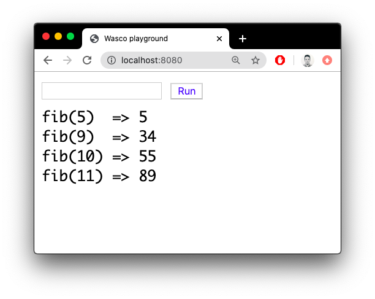

# Vasco

#### Compiling Scheme to WebAssembly ... somehow 

Original Scheme program:
```
(define (fib n)
    (cond
        ((<= n 2) 1)
        (else (+ (fib (- n 1)) (fib (- n 2))))))
```

Desugared program:
```
(define fib (void))
(set! fib
  (lambda (n)
    (if (<= n 2)
      1
      (+
        (fib (- n 1))
        (fib (- n 2))))))
```

Generated WASM module.wat:
```
(module
    (func $fib (param $n i32) (result i32)
        get_local $n
        i32.const 2
        i32.le_s
        (if (result i32)
            (then i32.const 1)
            (else get_local $n
                  i32.const 1
                  i32.sub
                  call $fib
                  get_local $n
                  i32.const 2
                  i32.sub
                  call $fib
                  i32.add)
        )
    )
    (export "dummy" (func $fib))
)
```

Running program in browser:




## Desugarer

Before:
```
(define foo 5)
(define (fact n)
    (if (= n 0)
        1
        (* n (fact (- n 1)))))

(display (fact foo))
```

After:
```
(define foo 5)
(define fact (void))
(define G157 (void))

(set! fact
  (lambda (n)
    (if (= n 0)
        1
        (* n (fact (- n 1))))))
(set! G157 (display (fact foo)))
```

## Quick start 

- install GO (tested on version 1.13)
  - set up $GOPATH
  - install package manager "dep"
  - install dep dependencies: `dep ensure` from git root
- generate code 
  - insert source code into stub inside `generator.go`
  - run program to get target code
    - it will replace existing example of module.wat
```bash
go run go-generator/main/generator.go go-generator/main/lexer.go go-generator/main/parser.go go-generator/main/utils.go
```
  
- convert generated WAT (WebAssembly Text Format) to WASM (binary) via WABT (WASM Binary Toolkit):
   - it will replace existing example of module.wasm
   - or use [online converter](https://webassembly.github.io/wabt/demo/wat2wasm) 
```bash
docker run -it --rm -u $(id -u):$(id -g) -v $PWD:/src -w /src jungomi/wabt wat2wasm server/module.wat -o server/module.wasm
```
- run server from `server` dir
  - `go run server.go`
  - or simply `python3 -m http.server 8080`
- open browser
  - navigate to http://localhost:8080
  - insert args and hit "Run" to call the function


## Notes

- racket bin directory on macOS: `/Applications/Racket v7.3/bin`
